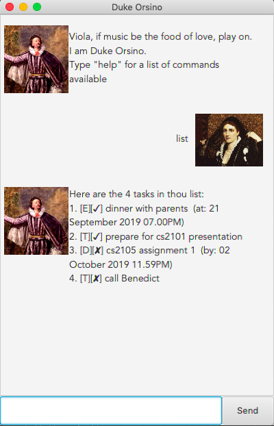

# Duke Orsino 
Personal Tasklist Manager
<br/>

# User Guide
Personal tasklist manager aimed at organising the current tasks 
that need to be done, as well as upcoming deadlines and events.

Theme is adopted from William Shakespeare's Twelfth Night. 
You are Viola giving commands to Duke Orsino, who will
respond to your commands. 

Screenshot:



<br/>


## 1. Setting up

**Prerequisites**
* Java Runtime Environment

**Running Duke Orsino**
1. Download `duke-0.5.jar` file from `duke` > `build` > `libs` 
    or [here](https://github.com/yewon0303/duke/releases/tag/v0.5.1) 
1. Open the jar file by
    2. Double-clicking on the jar file OR
    2. Typing `java -jar duke-0.5.jar` on Command Line Interface

<br/>


## 2. Usage

### 2.1 Features
* Interact with Duke Orsino to manage your tasks
* 3 types of tasks supported - Deadline, Event, Todo

Task type | Details required
------------ | -------------
_Deadline_ | Task detail, date and time of deadline
_Event_ | Task detail, date and time of event
_Todo_ | Task detail

<br/>


### 2.2 Commands 
* Type command into the textbox and click `send` to request action from Duke Orsino

<br/>

#### **2.2.1 Exiting the program: `bye`**
##### Quits the program.
##### Format: `bye` 
##### Expected outcome: 
``` 
        Bye. Hope to see thee again soon!
```

<br/>
<br/>


#### **2.2.2 Deleting a task: `delete`**
##### Delete the specified task from the list.
##### Format: `delete INDEX`
##### Example: `delete 2` deletes the 2nd task from the list
##### Expected outcome: 
``` 
        Noted. I've removed this task:
        [T][x] Prepare for CS2101 presentation
        Now thee have 3 tasks in the list.
```
<br/>
<br/>

#### **2.2.3 Marking a task done: `done`**
##### Marks a specified `undone [x]` task `done [✓]`.
##### Format: `done INDEX`
##### Example: `done 1` marks 1st task from the list done
##### Expected outcome: 
``` 
        Nice! I've marked this task as done:
        [D][✓] CS2105 assignment 1 (by 02 October 2019 11.59PM)
```
<br/>
<br/>


#### **2.2.4 Finding a task with given keyword: `find`**
##### Finds all tasks in the list with the keyword provided.
##### Format: `find KEYWORD`
##### Example: `find call` finds all tasks from the list containing the word call
##### Expected outcome: 
``` 
        Here are the matching tasks in thou list:
        1. [T][✓] call Benedict
        2. [T][x] call Ryan
```
<br/>
<br/>


#### **2.2.5 Listing all tasks: `list`**
##### Lists all tasks in the list.
##### Format: `list`
##### Expected outcome: 
``` 
        Here are the 4 tasks in thou list:
        1. [E][✓] dinner with parents (at: 21 September 2019 07.00PM)
        2. [T][x] call Ryan
        3. [D][x] CS2105 assignment 1 (by: 02 October 2019 11.59PM)
        4. [T][x] buy birthday present for Benedict
```
<br/>
<br/>


#### **2.2.6 Undoing the latest undoable command: `undo`**
##### Undoes the latest undoable command. 
##### Undoable commands include all add Task commands (`deadline`, `event`, `todo`), delete and done
##### Format: `undo`
##### Example: `delete 2` > `undo` marks task adds back the deleted task back into the list
##### Expected outcome: 
``` 
        Nice! Undone successful.
```
<br/>
<br/>


#### **2.2.7 Viewing a task: `view`**
##### Shows just the specified task.
##### Format: `view INDEX`
##### Example: `view 3` shows the 3rd task in the list
##### Expected outcome: 
``` 
        3. [D][x] CS2105 assignment 1 (by: 02 October 2019 11.59PM)
```
<br/>
<br/>


#### **2.2.8 Adding a Deadline task: `deadline`**
##### Adds a task with type `deadline` to the list.
##### Format: `deadline TASK /by DD/MM/YY HHMM`
##### Example: `deadline CS2101 peer review /by 02/10/2019 2359` adds a `deadline` task
##### Expected outcome: 
``` 
        Got it. I've added this task:
        [D][x] CS2101 peer review (by: 02 October 2019 11.59PM)
        Now thee have 5 tasks in thou list.
```
<br/>
<br/>


#### **2.2.9 Adding an Event task: `event`**
##### Adds a task with type `event` to the list.
##### Format: `event TASK /at DD/MM/YY HHMM`
##### Example: `event CS2103T team meeting /at 20/09/2019 1600` adds an `event` task
##### Expected outcome: 
``` 
        Got it. I've added this task:
        [E][x] CS2103T team meeting (at: 20 September 2019 04.00PM)
        Now thee have 5 tasks in thou list.
```
<br/>
<br/>


#### **2.2.10 Adding a Todo task: `todo`**
##### Adds a task with type `todo` to the list.
##### Format: `todo TASK`
##### Example: `todo print lecture slides` adds a `todo` task
##### Expected outcome: 
``` 
        Got it. I've added this task:
        [T][x] print lecture slides
        Now thee have 5 tasks in thou list.
```
<br/>
<br/>


## 3. Command summary
* Bye: `bye`
* Delete: `delete INDEX`
    * example: `delete 1`
* Done: `done INDEX`
    * example: `done 1`
* Find: `find KEYWORD`
    * example: `find call`
* List: `list`
* Undo: `undo`
* View: `view INDEX`
    * example: `view 1`
* Add Deadline: `deadline TASK /by DD/MM/YY HHMM`
    * example: `deadline CS2101 peer review /by 02/10/2019 2359`
* Add Event: `event TASK /at DD/MM/YY HHMM`
    * example: `event CS2103T team meeting /at 20/09/2019 1600`
* Add Todo: `todo TASK`
    * example: `todo print lecture slides`
